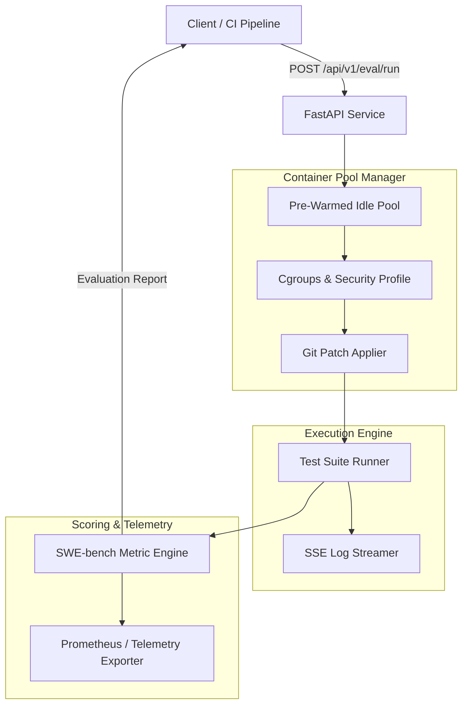

# SWE-Bench Verification Harness

An isolated, containerized test execution harness for running patch evaluations and computing SWE-bench metrics (`FAIL_TO_PASS`, `PASS_TO_PASS`, `PASS_TO_FAIL`, `RESOLVED`).

## Overview

The harness manages a pool of pre-warmed, unprivileged Docker/Podman micro-containers to apply Git patches, run test suites (`pytest`, `npm test`, `cargo test`), stream terminal logs via Server-Sent Events (SSE), and calculate transition metrics.

Containers run with rootless users, dropped Linux capabilities, network isolation, and strict cgroup CPU/memory limits to contain untrusted patch execution.

## Architecture



## Security Profile

Patch evaluation runs in sandboxed containers with the following defaults:

- Network: `--network none` (no external socket access)
- Capabilities: `cap_drop=ALL` (drops all Linux capabilities)
- Privileges: `no-new-privileges:true`
- Filesystem: Read-only rootfs (`--read-only`), ephemeral tmpfs mounted at `/tmp` and `/workspace`
- User: Non-root (`1000:1000`)
- Limits: 1GB RAM (no swap expansion), 2.0 vCPUs, max 100 PIDs (prevents fork exhaustion)

## Getting Started

### Prerequisites

- Python 3.10+
- Docker or Podman (optional for local mock testing)

### Local Setup

```bash
git clone https://github.com/swe-bench/verification-harness.git
cd verification-harness

python -m venv .venv
source .venv/bin/activate  # On Windows: .venv\Scripts\activate
pip install -r requirements.txt
```

### Starting the Server

```bash
uvicorn app.main:app --host 0.0.0.0 --port 8000
```

### Docker Compose

```bash
docker compose up --build -d
```

## API Reference

### 1. Submit Evaluation
`POST /api/v1/eval/run`

Query parameters:
- `sync` (bool, default: `true`): If `true`, blocks until evaluation completes. If `false`, returns immediately with `QUEUED` status.

Request:
```json
{
  "repo_url": "https://github.com/astral-sh/uv",
  "base_commit": "e3a89b1",
  "patch_diff": "diff --git a/uv/resolver.py b/uv/resolver.py\n--- a/uv/resolver.py\n+++ b/uv/resolver.py\n@@ -10,4 +10,4 @@\n def resolve_bug(x):\n-    return False\n+    return True\n",
  "test_command": "pytest tests/test_resolver.py",
  "base_test_command": "pytest tests/test_resolver.py",
  "timeout_seconds": 60,
  "environment": "python-3.11"
}
```

Response:
```json
{
  "task_id": "eval_7a8b9c0d1e2f",
  "status": "COMPLETED",
  "resolved": true,
  "metrics": {
    "fail_to_pass": ["tests/test_resolver.py::test_resolved_bug"],
    "pass_to_pass": ["tests/test_resolver.py::test_existing_feature"],
    "fail_to_fail": [],
    "pass_to_fail": [],
    "resolved": true,
    "pass_rate": 100.0,
    "total_tests_evaluated": 2,
    "resolution_status": "FULLY_RESOLVED"
  },
  "execution_time_ms": 284.1,
  "sandbox_acquisition_ms": 42.0
}
```

### 2. Stream Live Output
`GET /api/v1/eval/{task_id}/stream`

Streams logs and status updates using Server-Sent Events:
```http
event: status
data: {"event_type": "status", "status": "RUNNING_PATCHED_TESTS"}

event: log
data: {"event_type": "log", "chunk": "tests/test_resolver.py::test_resolved_bug PASSED\n"}

event: done
data: {"event_type": "done", "status": "COMPLETED"}
```

### 3. Health & Metrics
- `GET /health` - Pool capacity and daemon status
- `GET /metrics` - Prometheus metrics exposition

## Testing

Run unit and security jail tests:
```bash
pytest tests/ -v
```

Run load test benchmark:
```bash
python benchmarks/load_test_harness.py --url http://127.0.0.1:8000 --requests 50 --concurrency 10
```

Run demo client:
```bash
python test_client.py http://127.0.0.1:8000
```
